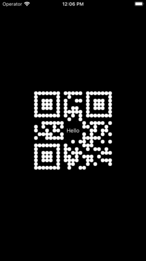

# @exzos28/react-native-qrcode-svg

A QR Code generator for React Native based on react-native-svg, to create QR codes like in Telegram

## Installation

```sh
npm install @exzos28/react-native-qrcode-svg
```

## Example




## Usage

```js
import { QrCodeSvg } from '@exzos28/react-native-qrcode-svg';

function App() {
  return (
    <QrCodeSvg
      frame={200}
      content={
        <View>
          <Text>Hello</Text>
        </View>
      }
    />
  );
}
```

## Contributing

See the [contributing guide](CONTRIBUTING.md) to learn how to contribute to the repository and the development workflow.

## License

MIT

---

Made with [create-react-native-library](https://github.com/callstack/react-native-builder-bob)
