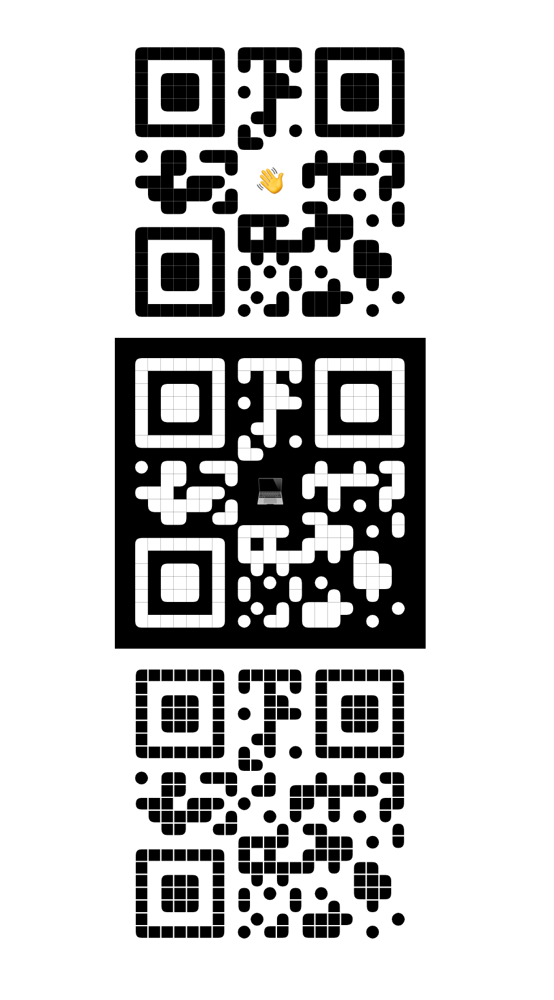

# react-native-qr-svg 📱

A QR Code generator for React Native based on react-native-svg. Effortlessly create QR codes with a style reminiscent of modern designs.

[](https://www.npmjs.com/package/react-native-qr-svg)
[](https://www.npmjs.com/package/react-native-qr-svg)
## Installation 🚀
Start by installing the necessary packages:
```sh
yarn add react-native-svg react-native-qr-svg
```

## Overview 🌟

This library provides a straightforward way to generate QR codes within React Native applications. The QR codes produced have a modern aesthetic, perfect for various design contexts.

## Customization 🎨

This library allows for easy customization of QR codes, enabling developers to adjust module color, gradient fill, shape, background color, size, and a logo overlay.

## Example 🖼️



## Props

| Property               | Description                                                                | Type                            | Default Value |
|-------------------------|-----------------------------------------------------------------------------|----------------------------------|----------------|
| `value`                 | The string to be converted into a QR code.                                 | `string`                         | (Required)     |
| `size`                  | Explicit pixel size. Omit it to have the QR code fill its container's width and stay square via `aspectRatio: 1`. | `number` |  |
| `errorCorrectionLevel`  | The error correction level for the QR code.                                | `'L' \| 'M' \| 'Q' \| 'H'`       | `'M'`          |
| `backgroundColor`       | The background color of the QR code.                                       | `string`                         | `'#ffffff'`    |
| `color`                 | The color of the QR code's modules.                                        | `string`                         | `'#000000'`    |
| `fill`                  | Solid color or gradient fill for the modules. Overrides `color`.           | `ColorValue \| GradientFill`     |                |
| `style`                 | Style for the container of the QR code.                                    | `StyleProp<ViewStyle>`           |                |
| `shape`                 | Built-in shape preset, or a fully custom renderer.                         | `'rounded' \| 'square' \| 'dots' \| 'triangle' \| CustomRenderer` | `'rounded'`    |
| `gap`                   | Gap between a module and its unconnected neighbors, as a fraction of one module (e.g. `0.01` = 1%). | `number` | shape-specific |
| `separated`             | Apply `gap` between every module, including connected ones (a visible grid line), instead of only unconnected ones. | `boolean` | `false` |
| `moduleProps`           | Props applied to the two underlying SVG paths that draw the modules.       | `PathProps`                      |                |
| `logo`                  | Logo/content rendered in the middle of the QR code.                        | `LogoConfig`                     |                |
| `testID`                | Base testID; sub-elements are suffixed (`-svg`, `-module`, `-content`).    | `string`                         | `'qr-code'`    |
| `onError`               | Called instead of throwing on a generation failure. See below.             | `(error: Error) => void`         |                |

`GradientFill`:

| Property | Description                                    | Type              | Default Value |
|----------|-------------------------------------------------|-------------------|----------------|
| `type`   | Discriminant, always `'gradient'`.              | `'gradient'`      | (Required)     |
| `colors` | 2 or more colors, distributed evenly.           | `ColorValue[]`     | (Required)     |
| ...      | Any other `LinearGradientProps` (`x1`, `y1`, ...) from `react-native-svg`. |  |  |

`LogoConfig`:

| Property          | Description                                              | Type                    | Default Value |
|--------------------|-----------------------------------------------------------|--------------------------|----------------|
| `source`           | Content rendered in the middle of the QR code.            | `React.ReactNode`        | (Required)     |
| `cells`            | How many modules wide/tall the cleared area behind it is. | `number`                 | `6`            |
| `style`            | Style for the logo's container.                           | `StyleProp<ViewStyle>`   |                |
| `backgroundProps`  | Props for the SVG rect drawn behind the logo.              | `RectProps`              |                |

### Responsive sizing

`size` is optional. All module geometry is built in a matrix-unit coordinate space (one module = 1 unit) and rendered via the SVG's `viewBox`, so scaling to any pixel size is handled entirely by the renderer — no JS measurement involved. Without `size`, the root view uses `aspectRatio: 1` and fills its container's width:

```tsx
<View style={{ width: '100%' }}>
  <QrCodeSvg value={value} />
</View>
```

Give the container (or `style`) a width for this to have something to fill. Pass `size` when you want an explicit pixel size instead.

Note `moduleProps` (e.g. `strokeWidth`) lives in that same matrix-unit space, so it scales with the rendered size rather than being a fixed pixel value.

### Error handling

By default, `QrCodeSvg` throws when it can't produce a QR code (for example, `value` is too long for the chosen `errorCorrectionLevel`) — in `__DEV__` this is an immediate crash so the problem is obvious during development; in production it falls back safely and warns via `console.warn` where possible.

Pass `onError` to take over that behavior yourself instead — the component then never throws, in any environment, and calls `onError(error)` when generation fails:

```tsx
<QrCodeSvg
  value={value}
  size={200}
  onError={(error) => reportToCrashlytics(error)}
/>
```

## Example 🛠️

Implement QR codes easily in your React Native app:

[Full example use can find here.](./example/src/App.tsx)
```tsx
import React from 'react';

import { StyleSheet, View, Text } from 'react-native';
import { QrCodeSvg, renderCircle, renderSquare, type CustomRenderer, type RenderParams } from 'react-native-qr-svg';

const SIZE = 140;
const CONTENT = 'Hello world!';

const render = ({ isFinderPattern, corners, cellSize }: RenderParams) =>
  isFinderPattern ? renderSquare(corners) : renderCircle(corners.center, cellSize);

const customRenderer: CustomRenderer = {
  render: {
    circle: render,
    path: render,
  },
};

export default function App() {
  return (
    <View style={styles.root}>
      <View style={styles.row}>
        <QrCodeSvg
          style={styles.qr}
          value={CONTENT}
          size={SIZE}
          logo={{ source: <Text style={styles.icon}>👋</Text>, cells: 5, style: styles.box }}
        />
        <QrCodeSvg
          style={styles.qr}
          value={CONTENT}
          size={SIZE}
          fill={{ type: 'gradient', colors: ['#0800ff', '#ff0000'] }}
        />
        <QrCodeSvg style={styles.qr} value={CONTENT} size={SIZE} shape="dots" />
      </View>
      <View style={styles.row}>
        <QrCodeSvg style={styles.qr} value={CONTENT} size={SIZE} shape={customRenderer} />
        <QrCodeSvg style={styles.qr} value={CONTENT} size={SIZE} separated />
        {/* No `size` - fills the wrapper's width and stays square via aspectRatio. */}
        <View style={[styles.qr, styles.responsive]}>
          <QrCodeSvg value={CONTENT} />
        </View>
      </View>
    </View>
  );
}

const styles = StyleSheet.create({
  root: {
    flex: 1,
    alignItems: 'center',
    justifyContent: 'center',
  },
  row: {
    flexDirection: 'row',
    alignItems: 'center',
    justifyContent: 'center',
  },
  box: {
    alignItems: 'center',
    justifyContent: 'center',
  },
  icon: {
    fontSize: 20,
  },
  qr: {
    padding: 15,
  },
  responsive: {
    width: SIZE,
  },
});
```

## Contributing 🤝

Want to contribute? Check out the [contributing guide](CONTRIBUTING.md) to learn how you can be a part of this project's development.

## License

This project is licensed under the MIT License.

---

Made with [create-react-native-library](https://github.com/callstack/react-native-builder-bob)
