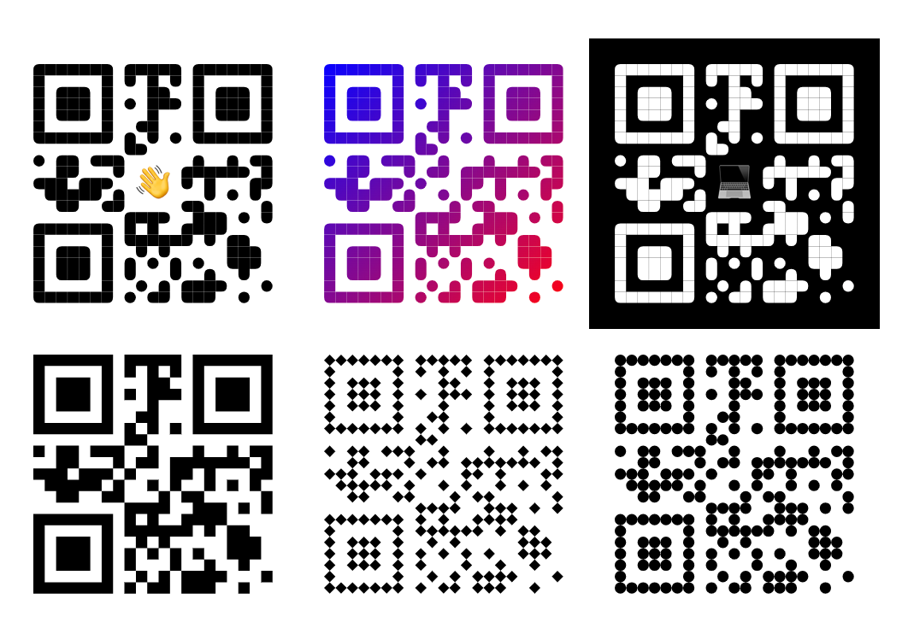

# react-native-qr-svg 📱

A QR Code generator for React Native based on react-native-svg. Effortlessly create QR codes with a style reminiscent of modern designs.

[](https://www.npmjs.com/package/react-native-qr-svg)
[](https://www.npmjs.com/package/react-native-qr-svg)
## Installation 🚀
Start by installing the necessary packages:
```sh
yarn add react-native-svg react-native-qr-svg
```

## Overview 🌟

This library provides a straightforward way to generate QR codes within React Native applications. The QR codes produced have a modern aesthetic, perfect for various design contexts.

## Customization 🎨

This library allows for easy customization of QR codes, enabling developers to adjust dot color, background color, frame size, and content within the code.

## Example 🖼️



## Props

| Property                    | Description                                                  | Type                                         | Default Value     |
|-----------------------------|--------------------------------------------------------------|----------------------------------------------|-------------------|
| `value`                     | The string to be converted into a QR code.                   | `string`                                     | (Required)        |
| `frameSize`                 | The size of the frame in which the QR code will fit.         | `number`                                     | (Required)        |
| `contentCells`              | The number of content cells in the QR code.                  | `number`                                     | `6`               |
| `errorCorrectionLevel`      | The error correction level for the QR code.                  | `low, medium, quartile, high, L, M, Q, H, M` | `M`                |
| `backgroundColor`          | The background color of the QR code.                        | `string`                                     | `'#ffffff'`       |
| `dotColor`                  | The color of the dots (circles) in the QR code.             | `string`                                     | `'#000000'`       |
| `style`                     | Style for the container of the QR code.                     | `StyleProp<ViewStyle>`                       |                   |
| `contentBackgroundRectProps`| Props for the background rectangle of the QR code content.  | `RectProps`                                  |                   |
| `content`                   | Additional content to be rendered within the QR code.       | `React.ReactNode`                            |                   |
| `contentStyle`              | Style for the additional content within the QR code.        | `StyleProp<ViewStyle>`                       |                   |
| `figureCircleProps`         | Props for the circular figures within the QR code.          | `CircleProps`                                |                   |
| `figurePathProps`           | Props for the path figures within the QR code.              | `PathProps`                                  |                   |
| `renderer`                  | Custom renderer for rendering QR code figures.              | `CustomRenderer`                             | `defaultRenderer` |
| `gradientColors`            | Array of colors for gradient fill of the QR code.           | `ColorValue[]`                               |                   |
| `gradientProps`             | Props for configuring the gradient of the QR code.          | `LinearGradientProps`                        |                   |


## Example 🛠️

Implement QR codes easily in your React Native app:

[Full example use can find here.](./example/src/App.tsx)
```js
import React from 'react';

import { StyleSheet, View, Text } from 'react-native';
import {
  QrCodeSvg,
  plainRenderer,
} from 'react-native-qr-svg';

const SIZE = 170;
const CONTENT = 'Hello world!';

export default function App() {
  return (
    <View style={styles.root}>
      <View style={styles.content}>
        <QrCodeSvg
          style={styles.qr}
          value={CONTENT}
          frameSize={SIZE}
          contentCells={5}
          content={<Text style={styles.icon}>👋</Text>}
          contentStyle={styles.box}
        />
        <QrCodeSvg
          style={styles.qr}
          gradientColors={['#0800ff', '#ff0000']}
          value={CONTENT}
          frameSize={SIZE}
        />
        <QrCodeSvg
          style={styles.qr}
          value={CONTENT}
          frameSize={SIZE}
          contentCells={5}
          content={<Text style={styles.icon}>💻</Text>}
          dotColor="#ffffff"
          backgroundColor="#000000"
          contentStyle={styles.box}
        />
        <QrCodeSvg
          style={styles.qr}
          renderer={plainRenderer}
          value={CONTENT}
          frameSize={SIZE}
        />
        <QrCodeSvg
          style={styles.qr}
          renderer={customRenderer}
          value={CONTENT}
          frameSize={SIZE}
        />
      </View>
    </View>
  );
}

const styles = StyleSheet.create({
  root: {
    flex: 1,
    alignItems: 'center',
    justifyContent: 'center',
  },
  content: {
    flexDirection: 'row',
    flexWrap: 'wrap',
    alignItems: 'center',
    justifyContent: 'center',
  },
  box: {
    alignItems: 'center',
    justifyContent: 'center',
  },
  icon: {
    fontSize: 20,
  },
  qr: {
    padding: 15,
  },
});
```

## Contributing 🤝

Want to contribute? Check out the [contributing guide](CONTRIBUTING.md) to learn how you can be a part of this project's development.

## License

This project is licensed under the MIT License.

---

Made with [create-react-native-library](https://github.com/callstack/react-native-builder-bob)
